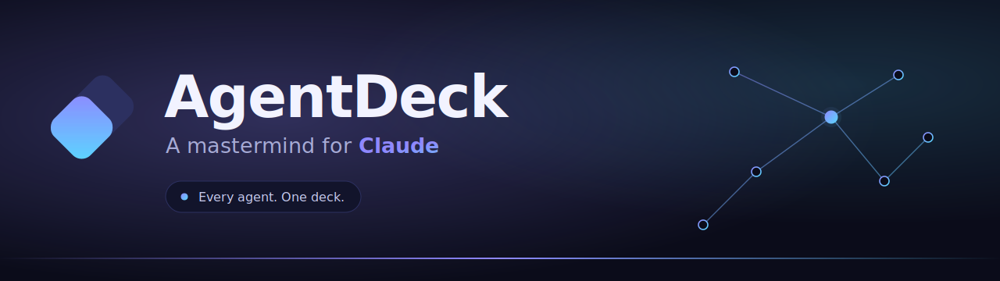
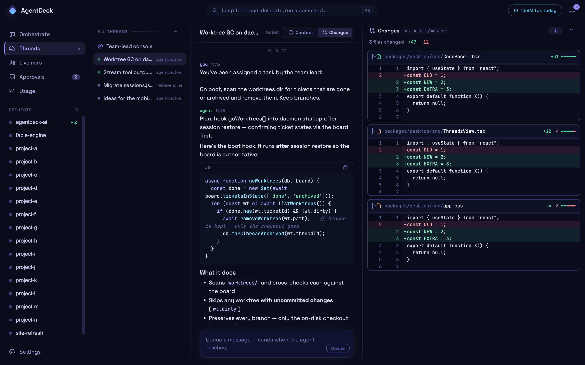
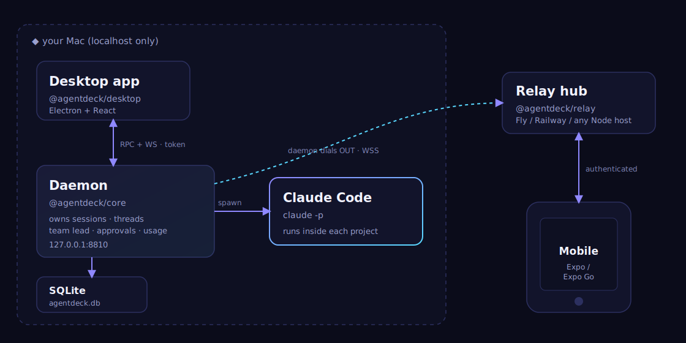

<div align="center">

<a href="https://agentdeck.run"></a>

<br>

[](#requirements)
[](#requirements)
[](LICENSE)
[](#contributing)

**Local orchestration for Claude Code** — spin up agents on tickets, watch them work
thread-by-thread, review diffs and approve tool calls, from a desktop app (and your
phone). Claude-specific by design: no multi-provider abstraction.

</div>

## What it is

AgentDeck is a daemon + desktop app that sits on top of the `claude` CLI. The daemon
owns your Claude sessions, threads, and a SQLite store; the desktop app is an
Electron/React client of it. Everything runs on **your Mac** — no account, no cloud
required to use it locally.

<div align="center">

<br><sub>Threads view with inline diff review (Context / Changes)</sub>
</div>

## Requirements

Verified on **macOS** only (Apple Silicon and Intel).

| | |
|---|---|
| **Node.js ≥ 20** | [nodejs.org](https://nodejs.org) or `brew install node` |
| **Claude Code CLI**, logged in | `npm install -g @anthropic-ai/claude-code` then `claude` once to sign in (Claude subscription or `ANTHROPIC_API_KEY`) |
| **git** | ships with Xcode Command Line Tools (`xcode-select --install`) |

Optional, only if you need them:

| | for |
|---|---|
| [Expo Go](https://expo.dev/go) | driving AgentDeck from your phone (`packages/mobile`) |
| `@agentdeck/relay`, local or deployed (Fly/Railway/any Node host) | the mobile app always pairs through a relay — the daemon dials out to it, phones dial in |
| PayPal REST app credentials | self-hosting the billing flow in `packages/website` |

## Quickstart

```sh
git clone https://github.com/MarcK98/agentdeck.git
cd agentdeck
npm install
npm run desktop
```

That's it — `npm run desktop` starts the Vite dev server (`:5183`), launches Electron
pointed at it, and Electron auto-starts the daemon (`127.0.0.1:8810`) if it isn't
already running. The daemon shells out to `claude` per session, so make sure the
Claude Code CLI (above) is installed and logged in first.

### Mobile (optional)

`packages/mobile` isn't part of the root npm workspace — it's a standalone Expo app:

```sh
cd packages/mobile
npm install
npx expo start
```

Scan the QR code with [Expo Go](https://expo.dev/go) to pair. The app always talks to
the daemon through a `@agentdeck/relay` — run one locally (`npm start -w
@agentdeck/relay`, default `:8820`) or point at a deployed one, and set
`SPAWN_RELAY_URL` / `SPAWN_RELAY_DAEMON_KEY` so the daemon dials out to it (see
`packages/relay`).

## How it fits together

<div align="center">

</div>

## Monorepo layout

```
packages/core     @agentdeck/core — the AgentDeck daemon (background process owning
                  Claude sessions, threads, SQLite store) plus orchestration:
                  projects, team lead, approvals, usage. Also still hosts the
                  legacy Discord bridge (src/index.js, see below).
packages/desktop  @agentdeck/desktop — Electron + React client of the daemon.
packages/mobile   agentdeck-mobile — Expo client, paired to the daemon via the relay.
packages/relay    @agentdeck/relay — bridges phones to your local daemon; the daemon
                  dials OUT to it, so nothing needs to be port-forwarded.
packages/website  Marketing site + billing (agentdeck.run).
src/              compatibility shims only (keep `node src/index.js` working for the
                  legacy Discord bridge until its hard-cut).
```

## Contributing

Bugs and ideas: [open an issue](https://github.com/MarcK98/agentdeck/issues/new).
Code changes: fork, branch, and open a PR against `master` — describe what changed
and why, link the issue if there is one. Nothing fancy required to get started
beyond the Quickstart above.

---

<details>
<summary><b>Legacy Discord bridge</b> (optional — the original chat-to-Claude bridge this repo grew out of)</summary>

Local Node server that watches chat channels (Discord for now) and forwards every incoming message to Claude Code (`claude -p`), replying in the channel with Claude's output. Paths below refer to `packages/core/src/` (root `src/` re-exports it).

### Setup

1. **Create a Discord bot** at https://discord.com/developers/applications
   - Bot tab → enable **MESSAGE CONTENT INTENT**
   - OAuth2 → URL Generator → scope `bot`, permissions `Send Messages`, `Read Message History` → invite it to your server
2. **Configure**
   ```sh
   cp .env.example .env
   # paste DISCORD_BOT_TOKEN, adjust the rest as needed
   ```
3. **Run**
   ```sh
   npm install
   npm start
   ```

DM the bot, or @mention it in a channel it can see. Each Discord channel keeps its own Claude conversation (via `--resume`, stored in `sessions.json`).

### How it works

```
Discord ──messageCreate──▶ src/channels/discord.js
                                │  sessionKey = discord:<channelId>
                                ▼
                          src/claude.js ──spawn──▶ claude -p "<msg>" --output-format json [--resume <id>]
                                │
                                ◀── { result, session_id }
                                ▼
                          reply back in channel (chunked to 2000 chars)
```

Messages within one channel are queued so replies stay in order.

### Attachments

Attach files to a message (image, PDF, code, text, …) and the bridge downloads
them to a temp folder, hands that folder to Claude via `--add-dir`, and appends
the file paths to the prompt so Claude can `Read` them. The folder is deleted
once the run finishes. A message can be attachment-only (no text needed).

Toggle with `ATTACHMENTS_ENABLED` and cap per-file size with `ATTACHMENT_MAX_MB`
(default 25). Oversized or un-fetchable attachments are skipped with a note in
the channel.

### Commands

Slash commands work from Discord. Two kinds:

- **Bridge commands** — handled by the server itself, never sent to Claude:
  - `/reset` — start a fresh conversation for this channel (clears its session)
  - `/stop` — cancel the run in progress
  - `/help` — list bridge commands plus the custom commands / skills available
    in this channel's project
  - `/status` — model + a summary of the last run
  - `/cost` — cost and token usage of the last run
  - `/model [name]` — show or set this channel's model (e.g. `/model sonnet`)
  - `/mcp` — list this project's MCP servers
  - `/agents` — list available subagents
- **Claude Code commands** — anything else starting with `/` is passed straight
  to `claude -p`, so your project `.claude/commands/` and skills (e.g.
  `/code-review`) just work.

`/status`, `/cost`, `/model`, `/mcp`, and `/agents` are reimplemented by the
bridge from data it already has, because the real ones are interactive. Other
terminal-only commands (`/workflows`, `/config`, …) can't run headlessly — the
bridge replies with a hint. In a server, prefix with a mention if
`DISCORD_REQUIRE_MENTION=true` (e.g. `@bot /reset`).

**Live progress** — during a run the bridge posts a status message that updates
in place with the tool Claude is currently running (great for long CI waits).
Toggle with `PROGRESS_ENABLED`.

### Terminal mode (interactive commands)

Truly interactive commands (`/workflows`, and anything else that needs a real
terminal) open **terminal mode**: the bridge launches an interactive Claude
session in a pseudo-terminal, renders its screen into a single Discord message
that updates live, and gives you buttons (↑ ↓ ← → Enter, Space, Esc, Ctrl-C,
Exit) to drive it. Plain messages are typed in as input; send `/exit` to leave.
While a terminal is open, no mention is needed and messages go straight to it.

- Trigger commands: `/terminal` (blank session) plus anything in
  `TERMINAL_TRIGGERS` (default `/workflows`). The triggering command is typed in
  automatically once the session boots.
- The session is a *fresh* interactive Claude (separate from the `-p` history).
  First time in a folder you'll see the trust / MCP prompts — answer them with
  the buttons.
- Auto-closes after `TERMINAL_IDLE_SECONDS` of silence; toggle the whole feature
  with `TERMINAL_ENABLED`.

Built on a real terminal emulator (`@lydell/node-pty` + `@xterm/headless`), so
the TUI renders as clean text. The native module loads lazily — if it can't
load, terminal mode is disabled and the rest of the bridge is unaffected.

### Per-channel projects

Each Discord channel maps to its own project folder, and Claude runs *inside* that folder — so every project gets its own `CLAUDE.md`, `.mcp.json` (project MCPs), `.claude/skills/`, and separate chat history (Claude Code stores sessions per working directory).

Resolution order for a message in `#my-app`:

1. `projects.json` override by channel ID
2. `projects.json` override by channel name
3. `<PROJECTS_ROOT>/my-app` (folder must exist)
4. `DEFAULT_PROJECT` (also used for DMs)
5. otherwise the channel is ignored

Optional `projects.json` (repo root):

```json
{
  "my-app": "/Users/mkhoury/Documents/some-other-folder",
  "123456789012345678": "/Users/mkhoury/Documents/mapped-by-channel-id"
}
```

Setup per project folder: add a `CLAUDE.md` for instructions, a `.mcp.json` for project MCP servers, and `.claude/skills/` for skills. Run `claude` manually in the folder once to approve project MCPs — headless `-p` runs won't show the trust prompt.

### Approvals & questions

When Claude needs permission (run a command, edit a file, use an MCP tool), the bridge posts the request in the originating channel with **Allow / Deny** buttons. Unanswered prompts auto-deny after `APPROVAL_TIMEOUT_SECONDS`. Anyone who can press buttons in the channel can approve — keep the server private.

Plumbing: `claude -p` runs with `--permission-prompt-tool mcp__approver__approve` (injected via `--mcp-config`); that MCP server forwards the request to the bridge on `127.0.0.1:APPROVAL_PORT`, which renders the buttons and returns allow/deny.

If Claude asks a clarifying question, it arrives as a normal reply — just answer in the channel (@mention it again if `DISCORD_REQUIRE_MENTION=true`); `--resume` continues the same conversation.

### Timeouts

Two limits guard a run, so long jobs don't get killed but true hangs still do:

- `CLAUDE_TIMEOUT_SECONDS` — **idle** limit: how long Claude may go silent
  *between* actions. Resets on every event; pauses while an approval waits on you.
- `CLAUDE_TOOL_TIMEOUT_SECONDS` — **tool** limit: how long a single running tool
  (build, test suite, `gh run watch`, a CI poll) may work with no output. A busy
  tool emits nothing, so the idle limit is suspended while one runs.

If Claude waits on long CI, raise `CLAUDE_TOOL_TIMEOUT_SECONDS` (default 1800s).

### Adding more channels

Write an adapter in `src/channels/<name>.js` exporting an async `start<Name>()` that returns a `stop()` function, register it in `ADAPTERS` in `src/index.js`, and add `<name>` to `CHANNELS` in `.env`. Telegram (`node-telegram-bot-api`, long polling) and Slack (`@slack/bolt` Socket Mode) both work locally without a public URL.

### Safety notes

- Anyone who can message the bot can drive Claude Code in `CLAUDE_CWD`. Keep `DISCORD_REQUIRE_MENTION=true` and use `DISCORD_ALLOWED_CHANNELS` in shared servers.
- By default `claude -p` runs with your CLI's default permission mode; restrict it with e.g. `CLAUDE_EXTRA_ARGS=--allowedTools "Read,Grep,Glob"` if you only want read-only access.

</details>
